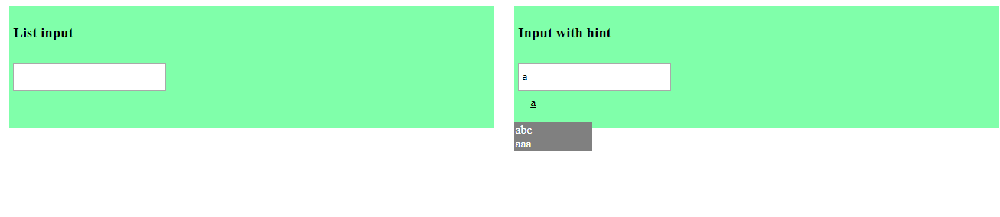

"# WebLab2" Лабораторна робота №2 "Доступ до об'єктної моделі Web-документа засобами мови Javascript" 
Виконав: Троян Борис КВ-62 
Варіант 24 (9)
Візуальний елемент "Підказка при уведенні"
Надати можливість виведення підказки при наборі тексту у елемент уведення "текстове поле".
Передбачити можливість створення списку слів-підказок.

Зліва - поле для запису в список підказок, зправа - поле з підказкою
Дії виконуються по події "onchange"

